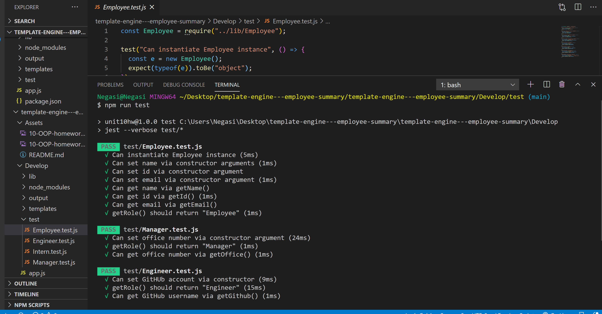
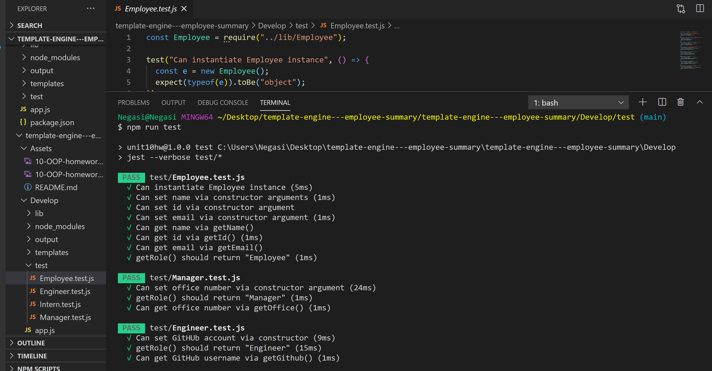

# template-engine---employee-summary

 ## Description
   
   ## Table of Contents
   * [Installation Instructions](#installation-instructions)
   
   * [Usage Instructions](#usage-instructions)
   
   * [Contribution](#contribution)
   
   * [Developer Contact Information](#Developer-Contact-Information)
     
  * [License](#license)

   ## Installation Instructions
   The developer is authorizing a free installation by cloning from the code [negasimichael](https://github.com/negasimichael/readme-generator)

   ## Usage Instructions
  i. Copy the code from the code [negasimichael](https://github.com/negasimichael/template-engine---employee-summary) and clone it in your in your comand line.

  ii. Make sure node and npm is installed in your computer.

iii. Once in the directory run npm install to install the node_modules needed to run the app.

iv. npm run to test

v .You will be prompted with questions.

vi. A "README.md Successfull Generated!!" will be desplayed after answering all the questions.

Click the demo image to see video demonstration:
  
<<<<<<< HEAD
  
=======
   
>>>>>>> 2eaae09445c1f84ca04aa3638fc823dfc02930c4

  
  ## Contribution
  [negasimichael](https://github.com/negasimichael/template-engine---employee-summary) is the only contrubuter of this project .

   ## Developer Contact Information
  * Linkedin Profile:[negasimichael](https://www.linkedin.com/feed/)
  * URL : N/A
  * Github URL:[negasimichael](https://github.com/negasimichael/template-engine---employee-summary)
  * Email: negasimichael1@gmail.com

   ## License
   .

  