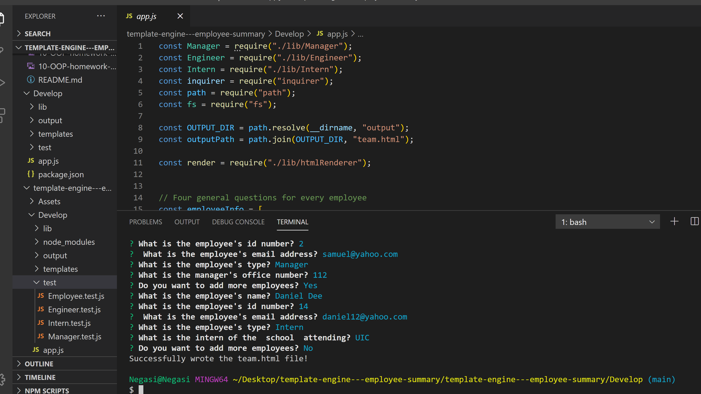

# template-engine---employee-summary

 ## Description
   
   ## Table of Contents
   * [Installation Instructions](#installation-instructions)
   
   * [Usage Instructions](#usage-instructions)
   
   * [Contribution](#contribution)
   
   * [Developer Contact Information](#Developer-Contact-Information)
     
  * [License](#license)

   ## Installation Instructions

   The developer is authorizing a free installation by cloning from the code [negasimichael](https://github.com/negasimichael/template-engine---employee-summary)

   ## Usage Instructions
  i. Copy the code from the code [negasimichael](https://github.com/negasimichael/template-engine---employee-summary) and clone it in your in your comand line.

  ii. Make sure node and npm is installed in your computer.

iii. Once in the directory run npm install to install the node_modules needed to run the app.

iv. You can run npm test to check if the app passes the test.

v.Then Run node app.js to fill employee information and select y to add more employee and n to finish.

vi .You will be prompted with questions and "Successfully wrote the team.html file!" will be desplayed after answering all the questions..

vii.Your team.html is in your output directory where you can open it in any browser.

  

You  can click the link  video demonstrating the entirety of the app's functionality 
[template-engine---employee-summary](https://drive.google.com/file/d/1rP1Vmon9O27A9EOr2N9Qxk4vqcytWojy/view?usp=sharing)

  ## Contribution
  [negasimichael](https://github.com/negasimichael/template-engine---employee-summary) is the only contrubuter of this project .

   ## Developer Contact Information
  * Linkedin Profile:[negasimichael](https://www.linkedin.com/feed/)
  * URL : N/A
  * Github URL:[negasimichael](https://github.com/negasimichael/template-engine---employee-summary)
  * Email: negasimichael1@gmail.com

   ## License
   .

  